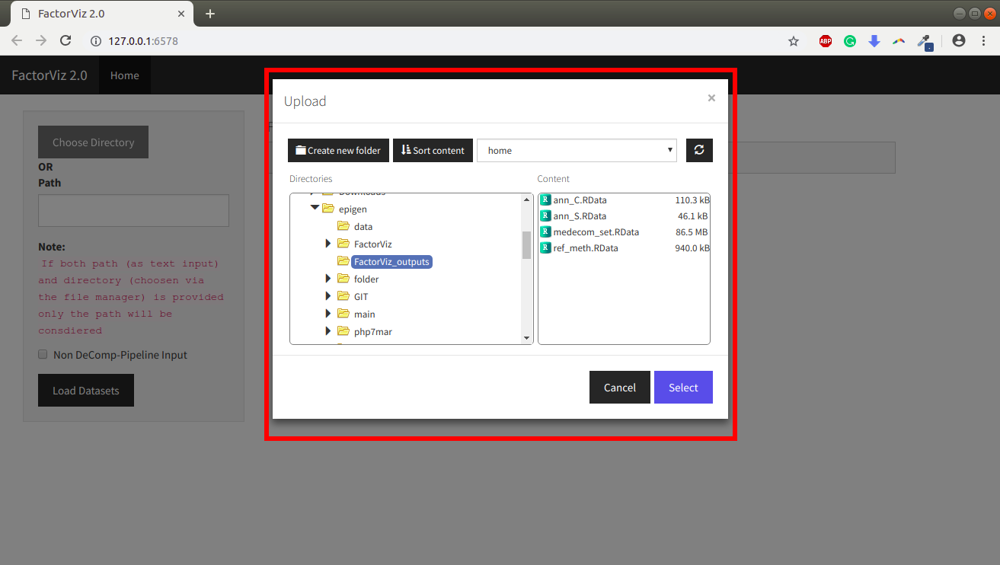
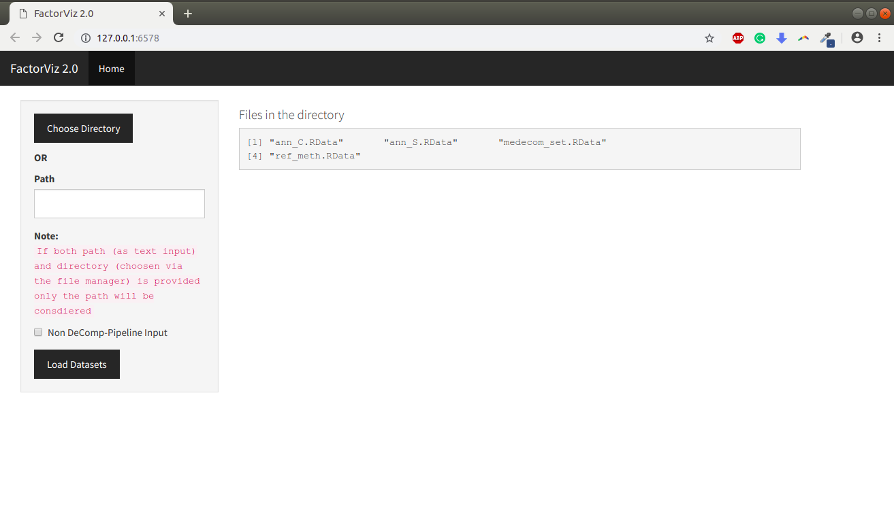

```{r setup, include = FALSE}
knitr::opts_chunk$set(
  collapse = TRUE,
  comment = "#>"
)
```
#Introduction
The package provides an interactive visualization and reporting environment for exploring the results of the methylome decomposition experiments carried out by [MeDeCom](http://public.genetik.uni-sb.de/medecom/)
## Installation
You can install the *FactorViz* through GitHub using *devtools*:

```{r, eval=F}
install.packages("devtools")
devtools::install_github("lutsik/FactorViz")
```

#Using FactorViz

## Default start-up
You can start *FactorViz* by using ```startFactorViz()``` command.

## Parameterized start-up
You can also initialise *FactorViz* by providing paths to the files or the [DeCompPipeline](https://github.com/lutsik/DecompPipeline) output to the ```startFactorViz()``` command. It accepts the following parameters.

* ```decomp_output```: takes in the directory path to decomp output
* ```medecom_set```:  takes in the path to medecom set file
* ```ann_C```: takes in the path to CpG Annotation file
* ```ann_S```: takes in the path to Sample Annotation file
* ```ref_meth```: takes in the path to Reference Methylome file

> Note:
If decomp_output provided all other parameters are force set to NULL


## Loading Data-sets
### Using DeCompPipeline Output
If paramaters are not provided you can load the file by providing the path to  [DeCompPipeline](https://github.com/lutsik/DecompPipeline) output directory (Fig 1a) in the user interface or by selecting the directory with the built-in file manager (Fig 1b, Fig 2)


<center>
{width=85%}


</center>
<center>
{width=85%}


</center>
<center>
{width=85%}


</center>


Once selected you can check the file names of that will be loaded into *FactorViz* in the UI (Fig 3).

<center>
{width=85%}


</center>


### Using Multiple Files
With *FactorViz* you can also load the dataset from multiple location by switching the Non DeCompPipeline checkbox (Fig 4)

<center>
{width=85%}


</center>


After the paths are set click on the ```Load Dataset``` button to load the dataset into *FactorViz* to carry out further analysis (Fig 5)

<center>
{width=85%}


</center>


The further section of ```K Selection, Lambda Selection, LMC, Proportions and Meta-Analysis``` are explained in detail in [MeDeCom](http://public.genetik.uni-sb.de/medecom/) documentation.
